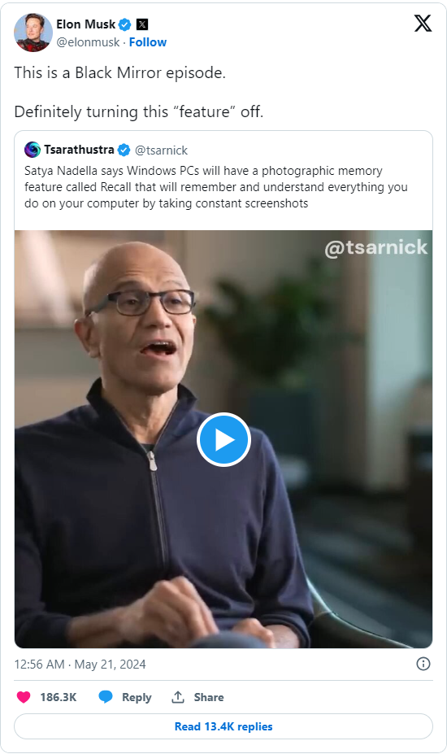

```
   ____                   ____                  ____   
  / __ \____  ___  ____  / __ \___  _________ _/ / /   
 / / / / __ \/ _ \/ __ \/ /_/ / _ \/ ___/ __ `/ / /    
/ /_/ / /_/ /  __/ / / / _, _/  __/ /__/ /_/ / / /     
\____/ .___/\___/_/ /_/_/ |_|\___/\___/\__,_/_/_/      
    /_/                                                                                                                         
```
**Enjoy this project?** Show your support by starring it! ⭐️ Thank you!

Join our [Discord](https://discord.gg/RzvCYRgUkx) and/or [Telegram](https://t.me/+5DULWTesqUYwYjY0) community to stay informed of updates!

# Take Control of Your Digital Memory

OpenRecall is a fully open-source, privacy-first alternative to proprietary solutions like Microsoft's Windows Recall or Limitless' Rewind.ai. With OpenRecall, you can easily access your digital history, enhancing your memory and productivity without compromising your privacy.

## What does it do?

OpenRecall captures your digital history through regularly taken snapshots, which are essentially screenshots. The text and images within these screenshots are analyzed and made searchable, allowing you to quickly find specific information by typing relevant keywords into OpenRecall. You can also manually scroll back through your history to revisit past activities.

https://github.com/openrecall/openrecall/assets/16676419/cfc579cb-165b-43e4-9325-9160da6487d2

## Why Choose OpenRecall?

OpenRecall offers several key advantages over closed-source alternatives:

- **Transparency**: OpenRecall is 100% open-source, allowing you to audit the source code for potential backdoors or privacy-invading features.
- **Cross-platform Support**: OpenRecall works on Windows, macOS, and Linux, giving you the freedom to use it on your preferred operating system.
- **Privacy-focused**: Your data is stored locally on your device, no internet connection or cloud is required. In addition, you have the option to encrypt the data on a removable disk for added security, read how in our [guide](docs/encryption.md) here. 
- **Hardware Compatibility**: OpenRecall is designed to work with a [wide range of hardware](docs/hardware.md), unlike proprietary solutions that may require specific certified devices.

<p align="center">
  <a href="https://twitter.com/elonmusk/status/1792690964672450971" target="_blank">
    
  </a>
</p>

## Features

- **Time Travel**: Revisit and explore your past digital activities seamlessly across Windows, macOS, or Linux.
- **Local-First AI**: OpenRecall harnesses the power of local AI processing to keep your data private and secure.
- **Semantic Search**: Advanced local OCR interprets your history, providing robust semantic search capabilities.
- **Full Control Over Storage**: Your data is stored locally, giving you complete control over its management and security.

<p align="center">
  
</p>


## Comparison


| Feature          | OpenRecall                    | Windows Recall                                  | Rewind.ai                              |
|------------------|-------------------------------|--------------------------------------------------|----------------------------------------|
| Transparency     | Open-source                   | Closed-source                                    | Closed-source                          |
| Supported Hardware | All                         | Copilot+ certified Windows hardware              | M1/M2 Apple Silicon                    |
| OS Support       | Windows, macOS, Linux         | Windows                                          | macOS                                  |
| Privacy          | On-device, self-hosted        | Microsoft's privacy policy applies               | Connected to ChatGPT                   |
| Cost             | Free                          | Part of Windows 11 (requires specialized hardware) | Monthly subscription                   |

## Quick links
- [Roadmap](https://github.com/orgs/openrecall/projects/2) and you can [vote for your favorite features](https://github.com/openrecall/openrecall/discussions/9#discussion-6775473)
- [FAQ](https://github.com/openrecall/openrecall/wiki/FAQ)

## Get Started

### Prerequisites
- Python 3.11
- MacOSX/Windows/Linux
- Git

To install:
```
python3 -m pip install --upgrade --no-cache-dir git+https://github.com/openrecall/openrecall.git
```

To run:
```
python3 -m openrecall.app
```
Open your browser to:
[http://localhost:8082](http://localhost:8082) to access OpenRecall.

## Arguments
`--storage-path` (default: user data path for your OS): allows you to specify the path where the screenshots and database should be stored. We recommend [creating an encrypted volume](docs/encryption.md) to store your data.

`--primary-monitor-only` (default: False): only record the primary monitor (rather than individual screenshots for other monitors)

## Uninstall instructions

To uninstall OpenRecall and remove all stored data:

1. Uninstall the package:
   ```
   python3 -m pip uninstall openrecall
   ```

2. Remove stored data:
   - On Windows:
     ```
     rmdir /s %APPDATA%\openrecall
     ```
   - On macOS:
     ```
     rm -rf ~/Library/Application\ Support/openrecall
     ```
   - On Linux:
     ```
     rm -rf ~/.local/share/openrecall
     ```

Note: If you specified a custom storage path at any time using the `--storage-path` argument, make sure to remove that directory too.

## Contribute

As an open-source project, we welcome contributions from the community. If you'd like to help improve OpenRecall, please submit a pull request or open an issue on our GitHub repository.

## Contact the maintainers
mail@datatalk.be

## License

OpenRecall is released under the [AGPLv3](https://opensource.org/licenses/AGPL-3.0), ensuring that it remains open and accessible to everyone.

